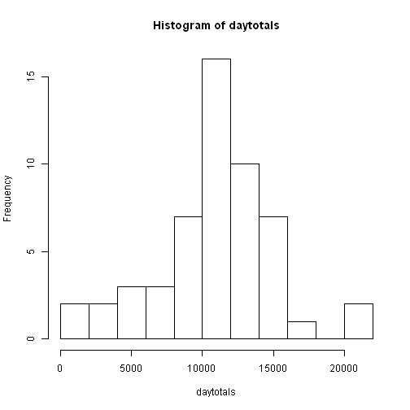
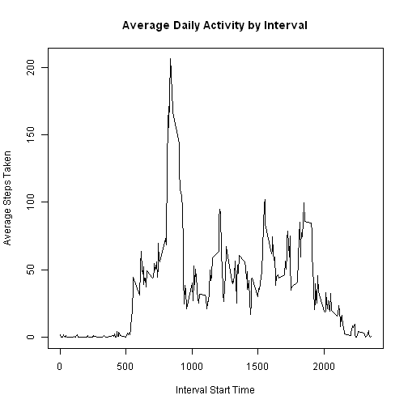
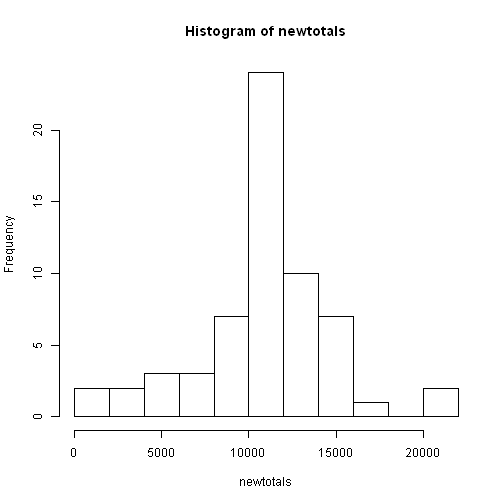

Analysis of Personal Movement Monitoring Data
========================
This is an analysis of personal movement monitoring data. 

**Loading the data**


```r
repdata <-read.csv(unzip('C:/Documents and Settings/Jennifer/Desktop/Coursera/Repeatable Data/repdata-data-activity.zip'),header=TRUE)
summary(repdata)
```

```
##      steps                date          interval     
##  Min.   :  0.00   2012-10-01:  288   Min.   :   0.0  
##  1st Qu.:  0.00   2012-10-02:  288   1st Qu.: 588.8  
##  Median :  0.00   2012-10-03:  288   Median :1177.5  
##  Mean   : 37.38   2012-10-04:  288   Mean   :1177.5  
##  3rd Qu.: 12.00   2012-10-05:  288   3rd Qu.:1766.2  
##  Max.   :806.00   2012-10-06:  288   Max.   :2355.0  
##  NA's   :2304     (Other)   :15840
```
**Mean Number of Total Steps**

First we total the steps per day and display the results in a histogram.  

```r
daytotals <- tapply(repdata$steps,INDEX=repdata$date,FUN=sum)
hist(daytotals,breaks=10)
```

 

We also calculate the mean and median of the number of steps taken per day.


```r
meanday <- mean(daytotals, na.rm=TRUE)
```
The mean is 1.0766189 &times; 10<sup>4</sup>.


```r
medianday <- median(daytotals,na.rm=TRUE)
```
The median is 10765.

**Average Daily Activity Pattern**

We average the number of steps taken for each 5-minute interval across all of the days and plot the result.


```r
intervalmeans <- aggregate(repdata$steps,by=list(repdata$interval),FUN=mean,na.rm=TRUE)

plot(intervalmeans,type="l",main="Average Daily Activity by Interval", ylab="Average Steps Taken", xlab="Interval Start Time")
```

 

We calculate which 5-minute interval contains the maximum number of steps.

```r
max(intervalmeans$x)
```

```
## [1] 206.1698
```

```r
intervalmax <- intervalmeans$Group.1[which.max(intervalmeans$x)]
```
The 5-minute interval containing the average maximum number of steps starts at 835.

**Inputing Missing Values**

First we calculate the total number of missing values (rows with NAs)

```r
library("plyr", lib.loc="C:/Program Files/R/R-3.1.2/library")
misses <- count(is.na(repdata$steps))[2,2]
```
The number of missing values (rows with NAs) is 2304.

Next we develop a strategy for replacing the missing values.  The strategy I chose was to replace the missing value with the mean for the 5-minute interval across all days. A new dataset is created using this strategy and the result is shown in a histogram.

```r
newdata <- repdata
for (i in 1:17568)
     if (is.na(repdata$steps[i]))newdata$steps[i]=intervalmeans$x[which(intervalmeans$Group.1==repdata$interval[i])] else newdata$steps[i] = repdata$steps[i]
newtotals <- tapply(newdata$steps,INDEX=newdata$date,FUN=sum)
hist(newtotals,breaks=10)
```

 

```r
newmean <- mean(newtotals)
print(newmean)
```

```
## [1] 10766.19
```

```r
newmedian <- median(newtotals)
print(newmedian)
```

```
## [1] 10766.19
```

The effect of replacing the NAs with the means is to increase the means and to create 2 days which consist entirely of the mean values - as a result, the mean also becomes the median!
 


